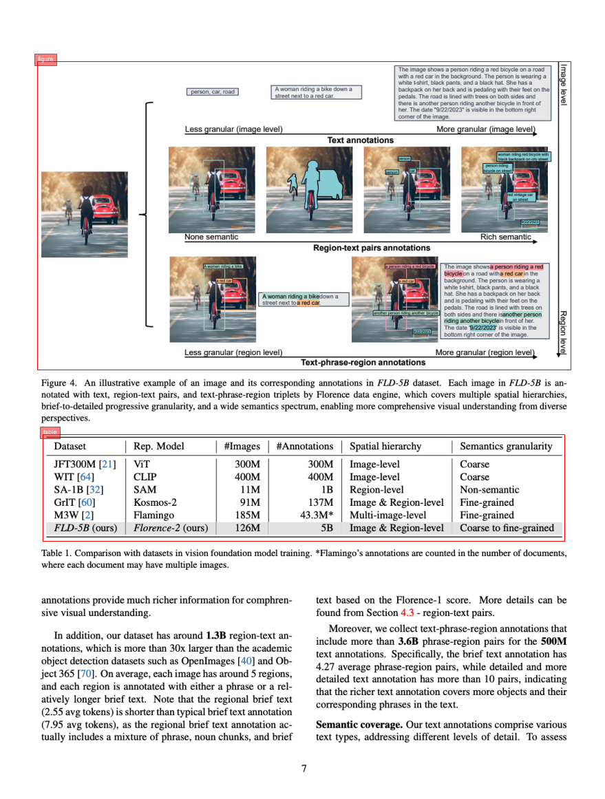

# LLaMA Factory Florence-2

This repo is a demo for using [LLaMA-Factory](https://github.com/hiyouga/LLaMA-Factory) to fine-tune [Florence-2](https://huggingface.co/microsoft/Florence-2-large) on [TF-ID-arxiv-papers dataset](https://huggingface.co/datasets/yifeihu/TF-ID-arxiv-papers).
Please first install the environment according to the README of [LLaMA-Factory](https://github.com/hiyouga/LLaMA-Factory?tab=readme-ov-file#installation).



## Data

Download images from https://huggingface.co/datasets/yifeihu/TF-ID-arxiv-papers/tree/main

```bash
wget https://huggingface.co/datasets/yifeihu/TF-ID-arxiv-papers/resolve/main/arxiv_paper_images.zip
```

Copy `arxiv_paper_images.zip` to `LLaMA-Factory/data` folder, unzip `arxiv_paper_images.zip`, and rename the folder to `TF-ID-arxiv-papers`

Download annotations from https://huggingface.co/datasets/yifeihu/TF-ID-arxiv-papers/tree/main

```bash
wget https://huggingface.co/datasets/yifeihu/TF-ID-arxiv-papers/raw/main/annotations_no_caption.json
```

Convert `annotations_no_caption.json` to LLaMA-Factory format:

```bash
python3 convert.py annotations_no_caption.json TF-ID-arxiv-papers.json
```

The converted format is as follows, where the 'loc' in the assistant's response represents normalized coordinates ranging from [0, 1000]. `<OD>` stands for the `Object Detection` task, which in the Florence-2 [processor](https://huggingface.co/microsoft/Florence-2-large/blob/39ddb416a9819d9fa1bacad7b7899099ae4b0a59/processing_florence2.py#L118) will be converted to the actual prompt "Locate the objects with category name in the image."

```json
{
  "messages": [
    {
      "role": "user",
      "content": "<OD>"
    },
    {
      "role": "assistant",
      "content": "table<loc_173><loc_507><loc_837><loc_656>figure<loc_170><loc_80><loc_827><loc_403>"
    }
  ],
  "images": ["TF-ID-arxiv-papers_demo_data/arxiv_2407_02687_7.png"]
}
```

Copy `TF-ID-arxiv-papers.json` to `LLaMA-Factory/data/` dir, and add new dataset in `dataset_info.json` file:

```json
 "TF-ID-arxiv-papers": {
    "file_name": "TF-ID-arxiv-papers.json",
    "formatting": "sharegpt",
    "columns": {
      "messages": "messages",
      "images": "images"
    },
    "tags": {
      "role_tag": "role",
      "content_tag": "content",
      "user_tag": "user",
      "assistant_tag": "assistant"
    }
  }
```

Edit `LLaMA-Factory/examples/train_full/florence2_full_sft.yaml` file, change `dataset` to `TF-ID-arxiv-papers`

## Training

Start training:

```bash
llamafactory-cli train examples/train_full/florence2_full_sft.yaml
```

After training finished, modify `saves/florence2-large/full/sft/config.json` file(I still haven't figured out why the saved config has the following issues that need to be modified; it shouldn't be necessary.):

Change `auto_map`, from:

```json
  "auto_map": {
    "AutoConfig": "configuration_florence2.Florence2Config",
    "AutoModel": "modeling_florence2.Florence2ForConditionalGeneration",
    "AutoModelForCausalLM": "microsoft/Florence-2-large-ft--modeling_florence2.Florence2ForConditionalGeneration"
  }
```

to

```json
  "auto_map": {
    "AutoConfig": "configuration_florence2.Florence2Config",
    "AutoModelForCausalLM": "modeling_florence2.Florence2ForConditionalGeneration"
  }
```

Change vision_config's `model_type`

```json
{
  "vision_config": {
    "model_type": "davit"
  }
}
```

## Inference

```bash
python3 demo.py LLaMA-Factory/saves/florence2-large/full/sft example.png
# </s><s>table<loc_70><loc_543><loc_932><loc_676>figure<loc_61><loc_76><loc_942><loc_462></s>
# Image saved to output.png
```

Use the trained model for inference. In [post_process_generation](https://huggingface.co/microsoft/Florence-2-large/blob/39ddb416a9819d9fa1bacad7b7899099ae4b0a59/processing_florence2.py#L307), the
model's output string will be parsed, and the final result will be in the following format:

```
{"<OD>": {"bboxes": [[x1, y1, x2, y2], ...], "labels": ["label1", "label2", ...]} }
```
